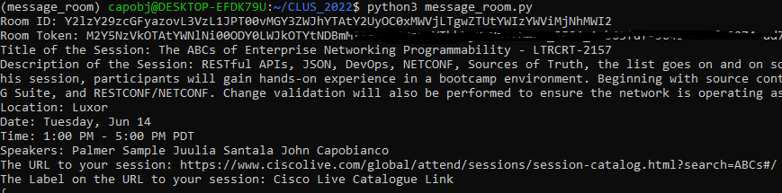
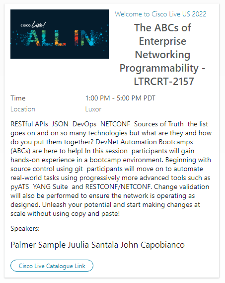
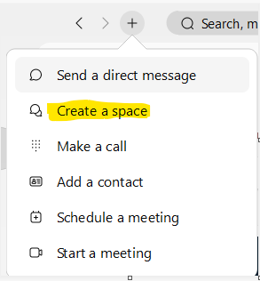
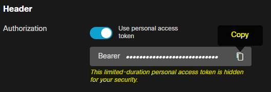
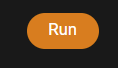
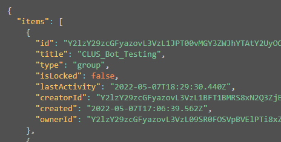
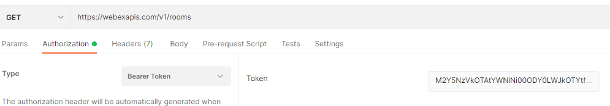
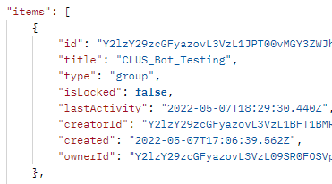

# pyWebExMessage - WebEx Bot that generates adaptive cards to a WebEx Room

## Examples
Running the Bot (Questions)



Output



## Getting Started with CLUS_2022 WebEx Message Room Bot
As a first time speaker I thought using WebEx to expand the interactivity and longevity of my sessions I wrote this bot. I wanted to share with other Speakers in case they wanted to use it for their sessions. 

To get started with CLUS_2022 WebEx Bot, follow the steps below:
### Create A Room for Your Session
In WebEx create and customize a room for your session


### Get a 24-hour token and Room ID
Visit the following developer.webex.com URL to get the room ID:
[List_Rooms](https://developer.webex.com/docs/api/v1/rooms/list-rooms)

#### Get a 24-hour token
Click the copy button to obtain a 24-hour token. This token will be used to access the room. Keep it safe and secure. I recommending using environment variables to store the token so you do not have to input it everytime you run the bot.


#### Get the Room ID
Next get the room ID for the room you created. You need this to pass messages into the room with the bot. You can get the room ID in the browser directly or with a tool like Postman.

##### In the browser 
Click Run


Find your room

##### In Postman
After you have the token and Rooms URL you can use Postman to get your rooms as well. Make a new GET request to the rooms URL. Specify Bearer token as the Authorization Type and paste in your token. Save this request if you would like in a Collection for reuse. 




### Installing the bot
To install the bot there are a few simple steps:
#### Setup a virtual environment
##### Ubuntu Linux 
###### The following instructions are based on Windows WSL2 and Ubuntu however any flavour of Linux will work with possibly slightly different commands.

##### Confirm Python 3 is installed

#####
```console

$ python3 -V
Python 3.9.10

```

##### Create and activate a virtual environment

#####
```console

$ sudo apt install python3-venv
$ python3 -m venv message_room
$ source message_room/bin/activate
(message_room)$

```
#### Install the bot
```console

(message_room)$pip install pywebexmessage

```
### Windows

#### Confirm Python 3.9 is installed
##### [Download Python](https://python.org)
#### Create and activate a virtual environment
#####
```console

C:\>python3 -m venv message_room
C:\>message_room\Scripts\activate
(message_room) C:\>

```
#### Install the requirements
```console

(message_room)$pip install pywebexmessage

```

### Using the bot
#### Run the bot as an interactive session
```console

(message_room)$ message_room

```
#### The form questions:

##### Question 1 - What is the roomID?

##### Question 2 - What is the token?

##### Question 3 - What is the image URL?

##### Question 4 - What is the small header text?

##### Question 5 - What is the title of the session?

##### Question 6 - What is the description of the session?

##### Question 7 - Where is the session?

##### Question 8 - What day is the session?

##### Question 9 - What time is the session?

##### Question 10 - Who are the speakers?

##### Question 11 - URL of the session or any other URL?

##### Question 12 - A label for the URL button?

#### Environment variables

Every question can be stored as a variable in the environment. This is useful if you want to reuse the same question in multiple messages.

Linux:
export ROOMID=<roomID>

export TOKEN=<token>

export IMAGE=<imageURL>

export HEADER=<smalltext>

export TITLE=<title>

export DESCRIPTION=<description>

export LOCATION=<location>

export DATE=<date>

export TIME=<time>

export SPEAKERS=<speakers>

export URL=<url>

export URL_LABEL=<url_label>

Windows:
set ROOMID=<roomID>

set TOKEN=<token>

set IMAGE=<imageURL>

set HEADER=<smalltext>

set TITLE=<title>

set DESCRIPTION=<description>

set LOCATION=<location>

set DATE=<date>

set TIME=<time>

set SPEAKERS=<speakers>

set URL=<url>

set URL_LABEL=<url_label>